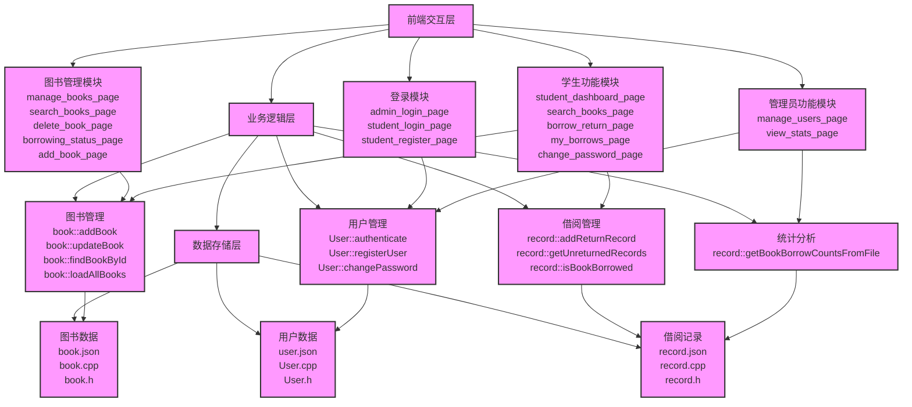
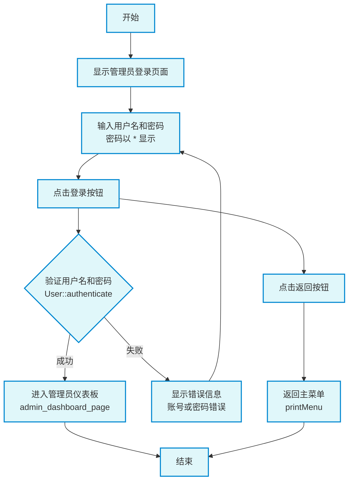
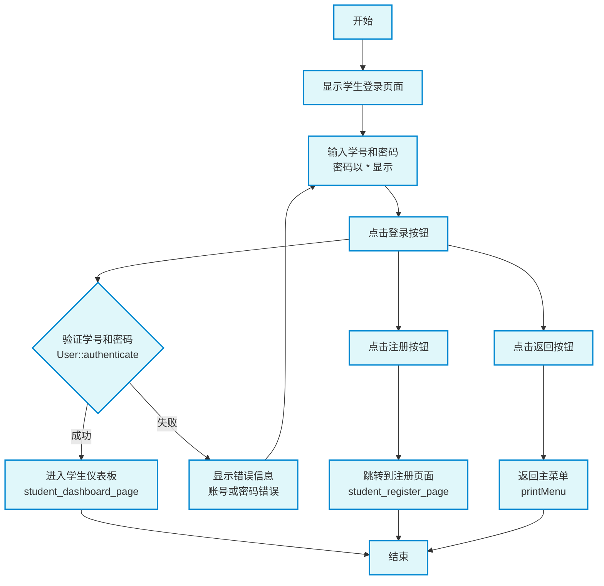
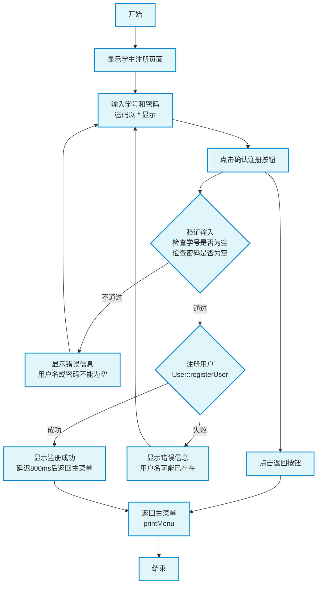
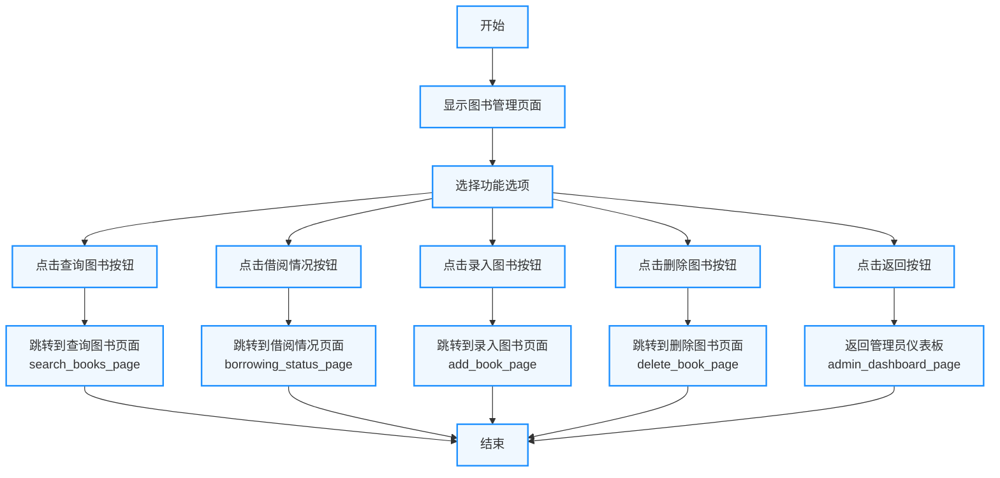
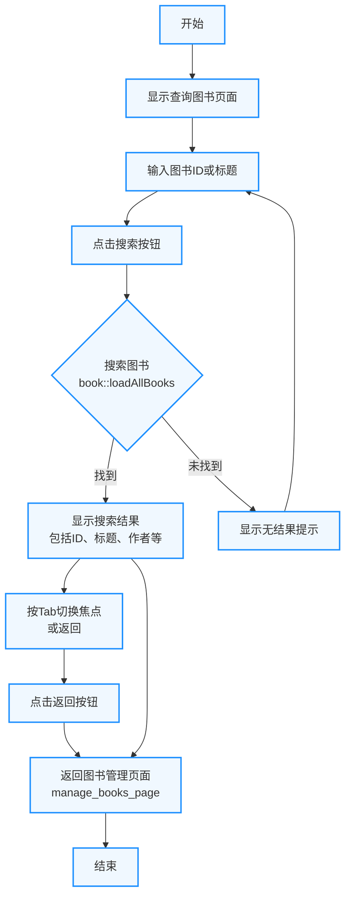
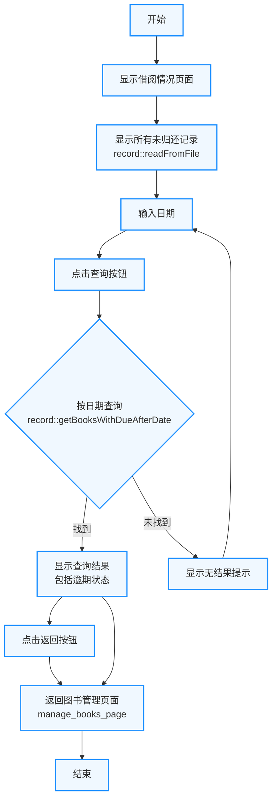
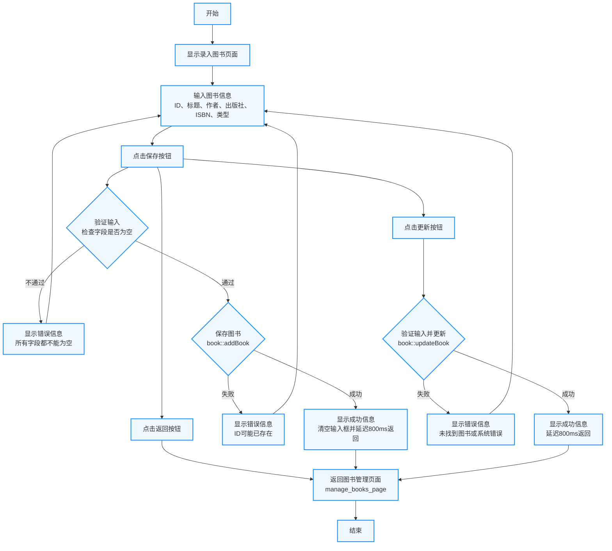
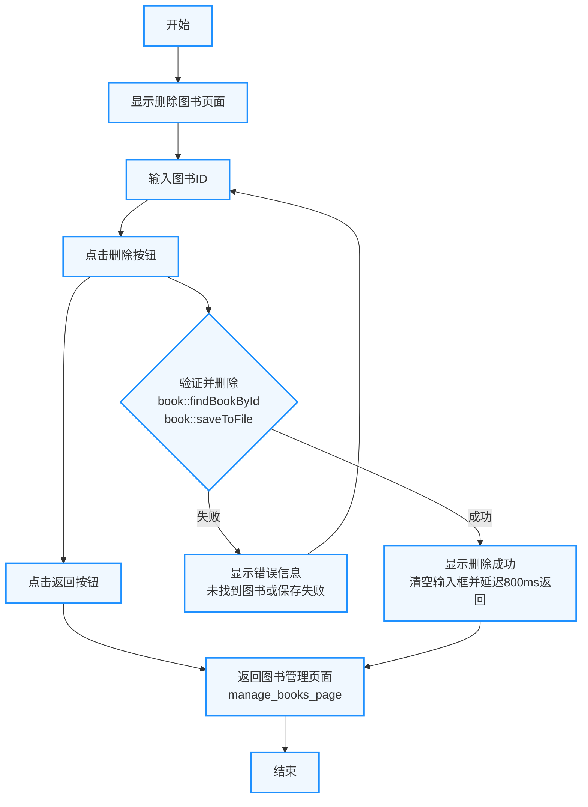

# 一、需求分析

## 1.系统概述

电子图书馆管理系统是基于C语言开发的一款高效图书管理应用程序，旨在实现图书馆的信息化管理，提升图书借阅与管理的便捷性和准确性。该系统通过文件存储实现数据持久化，支持多用户操作，涵盖管理员和学生两种角色。系统主要功能包括：多用户登录验证，确保安全访问；管理员录入、修改、删除图书信息；学生通过图书名称或编号查询图书详情并办理借阅，自动生成归还日期；管理员查询到期或即将到期的借阅记录；统计图书分类、借阅次数及库存情况。此外，系统提供独创DIY功能，如推荐热门图书或用户借阅偏好分析，增强用户体验。程序采用模块化设计，以菜单驱动界面提供清晰的操作提示，支持流程图辅助设计，数据输入时明确提示内容、格式及结束方式。通过文件读写操作，所有信息实现可靠存储与更新，满足现代图书馆管理需求。

## 2.系统运行环境

### （1）硬件环境

- 设备：MacBook Pro (13-inch, 2020, Two Thunderbolt 3 ports)  
- 处理器：2.0 GHz Quad-Core Intel Core i5
- 内存：16 GB 2133 MHz LPDDR3
- 存储：512 GB SSD
- 显卡：Intel Iris Plus Graphics 645  

### （2）软件环境：  
- 操作系统：macOS Sequoia, Version 15.3.2  
- 包管理软件：Homebrew 
- 引入第三方库：ftxui、nlohmannJSON

## 3、功能需求描述：

### （1）登录模块
- **功能概述**：登录模块支持多用户登录，包括管理员和学生两种角色。用户需输入用户名和密码进行身份验证，密码正确方可登录。学生用户还可通过注册功能创建新账号。
- **实现细节**：
  - **管理员登录**：通过 `admin_login_page()` 实现，提供用户名和密码输入框，密码以 `*` 显示，验证失败时显示错误信息，成功后进入管理员仪表板。
  - **学生登录**：通过 `student_login_page()` 实现，提供学号和密码输入框，支持登录和注册功能，验证失败时显示错误信息，成功后进入学生仪表板。
  - **学生注册**：通过 `student_register_page()` 实现，学生可输入学号和密码注册新账号，若用户名已存在则显示错误信息，成功后自动返回主菜单。

### （2）图书管理模块
- **功能概述**：图书管理模块允许管理员录入、修改、删除图书信息，并支持查询图书和借阅状态。
- **实现细节**：
  - **图书录入**：通过 `add_book_page()` 实现，管理员输入图书ID、标题、作者、出版社、ISBN 和类型，点击“保存”或“更新”按钮完成操作，支持输入验证，成功后自动返回图书管理页面。
  - **图书查询**：通过 `search_books_page()` 实现，支持按图书ID或标题搜索，显示图书详细信息，管理员可额外查看借阅者和应还日期。
  - **图书删除**：通过 `delete_book_page()` 实现，管理员输入图书ID执行删除操作，成功后自动返回图书管理页面。
  - **借阅状态查询**：通过 `borrowing_status_page()` 实现，管理员可查看所有未归还图书，或按归还日期查询到期或即将到期的图书，逾期记录以红色高亮。

### （3）学生功能模块
- **功能概述**：学生功能模块支持学生查询图书、借阅图书、查看借阅记录和修改密码。
- **实现细节**：
  - **图书查询**：通过 `search_books_page()` 实现，学生可按ID或标题搜索图书，查看图书状态（可借阅或已借出），但无法查看借阅者信息。
  - **借阅与归还**：通过 `borrow_return_page()` 实现，学生输入图书ID可查询图书状态并执行借阅或归还操作，借阅成功后显示应还日期（15天后），逾期信息以红色高亮。
  - **查看借阅记录**：通过 `my_borrows_page()` 实现，学生可查看所有借阅记录，包括图书信息、借阅时间、应还时间和逾期状态，逾期未还记录以红色高亮，已归还但曾逾期的记录以黄色高亮。
  - **修改密码**：通过 `change_password_page()` 实现，学生输入原密码和新密码进行修改，验证通过后自动返回学生仪表板。

### （4）管理员功能模块
- **功能概述**：管理员功能模块支持用户管理和统计功能。
- **实现细节**：
  - **用户管理**：通过 `manage_users_page()` 实现，管理员可查看学生用户列表、搜索用户、查看用户借阅记录，并为学生重置密码。有逾期未还图书的学生以红色高亮。
  - **统计信息**：通过 `view_stats_page()` 实现，显示所有图书的借阅次数统计，按借阅次数降序排列，包含图书ID、标题、作者、类型和借阅次数。

### （5）DIY功能模块
- **功能概述**：实现了一个创新功能，即图书借阅次数统计和可视化展示，帮助管理员了解图书的受欢迎程度。
- **实现细节**：
  - **借阅次数统计**：通过 `view_stats_page()` 实现，统计每本图书的借阅次数，数据从 `record.json` 文件读取，展示时按借阅次数降序排列，方便管理员分析热门图书。

# 二、系统设计

## 1、总体开发思想：

### （1）主要的数据结构
系统主要使用以下数据结构来管理和组织数据：
- **`std::vector`**：用于动态存储图书、用户和借阅记录的列表。`std::vector` 提供了高效的动态数组操作，支持快速的增删改查，适用于图书列表（`std::vector<book>`）、用户列表（`std::vector<User>`）和借阅记录（`std::vector<record>`）的存储与遍历。
- **`std::map`**：用于快速查找和统计。例如，在统计图书借阅次数时，使用 `std::map<int, int>` 存储图书ID与其借阅次数的映射；在查询图书详情时，使用 `std::map<std::string, book>` 快速定位图书对象。
- **结构体/类**：
  - `book` 类：表示图书实体，包含图书ID、标题、作者、出版社、ISBN、类型和可用状态等属性。
  - `User` 类：表示用户实体，包含用户ID、用户名、密码和角色（管理员或学生）等属性。
  - `record` 类：表示借阅记录，包含图书ID、借阅者ID、借阅时间、归还时间和归还状态等属性。
- **辅助数据结构**：
  - `std::string`：用于存储文本信息，如图书标题、作者名等。
  - `enum`：定义图书类型（如 `FICTION`、`NON_FICTION` 等）和用户角色（如 `ADMIN`、`STUDENT`）。

### （2）系统架构
系统采用模块化设计，分为前端交互层、业务逻辑层和数据存储层：
- **前端交互层**：
  - 使用 `ftxui` 库实现交互式终端界面，提供菜单驱动的用户操作体验。
  - 模块包括：登录页面（`admin_login_page`、`student_login_page`）、图书管理页面（`manage_books_page`）、学生仪表板（`student_dashboard_page`）等。
  - 界面支持输入框、按钮、菜单列表等组件，动态渲染图书列表、借阅记录等信息。
- **业务逻辑层**：
  - 核心功能模块包括登录验证、图书管理、借阅管理、用户管理和统计分析。
  - 每个功能通过独立的函数实现，如 `add_book_page` 负责图书录入，`borrow_return_page` 负责借阅与归还。
  - 逻辑层负责处理用户输入、调用数据层接口，并将结果反馈给前端。
- **数据存储层**：
  - 数据存储在文件系统中，使用 JSON 格式保存图书（`book.json`）、用户（`user.json`）和借阅记录（`record.json`）。
  - 数据操作通过 `book`、`User` 和 `record` 类中的静态方法实现，如 `book::loadAllBooks()`、`record::readFromFile()` 等。
- **模块间交互**：
  - 前端通过调用业务逻辑层函数（如 `User::authenticate`）实现登录验证。
  - 业务逻辑层通过数据存储层接口（如 `book::addBook`）完成数据读写。
  - 数据以对象形式在各层间传递，例如 `book` 对象从存储层加载后传递到逻辑层，再由前端渲染。

### （3）数据存储方式
系统采用 **Vector + 文件读写 + JSON** 的方式进行数据存储和交换：
- **存储介质**：
  - 数据存储在本地文件系统中，分别使用以下文件：
    - `books/book.json`：存储所有图书信息。
    - `users/user.json`：存储所有用户信息。
    - `records/record.json`：存储所有借阅记录。
- **数据格式**：
  - 使用 JSON 格式存储数据，利用 `nlohmann/json` 库进行序列化和反序列化。
  - 示例：
    - 图书记录：`{"bookId": "1", "title": "C++ Primer", "author": "Stanley B. Lippman", ...}`
    - 用户记录：`{"id": 1, "username": "admin", "password": "admin123", "role": "ADMIN"}`
    - 借阅记录：`{"bookID": 1, "borrowerID": 2, "borrowTime": 1625097600, "returnTime": 0}`
- **读写操作**：
  - **读取**：通过 `std::ifstream` 读取 JSON 文件，使用 `nlohmann::json` 解析为对象列表。例如，`book::loadAllBooks()` 读取 `book.json` 并返回 `std::vector<book>`。
  - **写入**：通过 `std::ofstream` 将对象列表序列化为 JSON 格式并写入文件。例如，`book::saveToFile()` 将更新后的图书列表写入 `book.json`。
- **数据管理**：
  - 使用 `std::vector` 在内存中临时存储数据，程序启动时从文件加载，操作完成后写入文件，确保数据持久化。
  - 每次操作（如添加图书、借阅图书）都会重新加载和保存文件，确保数据一致性。

### （4）使用的语言
- **编程语言**：C++（标准：C++11 及以上）。
- **第三方库**：
  - **`ftxui`**：用于构建交互式终端界面，提供输入框、按钮、菜单等组件，支持动态渲染和事件处理。
  - **`nlohmann/json`**：用于 JSON 数据序列化和反序列化，支持将 C++ 对象与 JSON 文件相互转换。
- **开发工具**：
  - 编译器：G++。
  - IDE：CLion、VSCode、Trae。
- **文件操作**：使用 C++ 标准库 `<fstream>` 实现文件读写。
- **时间处理**：使用 `<ctime>` 管理借阅时间、归还时间和逾期计算。
- **其他**：使用 `<vector>`、`<map>`、`<algorithm>` 等标准库组件进行数据管理和排序。

## 2、系统模块结构图

### 说明
- **层次划分**：
  - **前端交互层**：包含登录模块、图书管理模块、学生功能模块和管理员功能模块，负责用户界面交互。
  - **业务逻辑层**：包含用户管理、图书管理、借阅管理和统计分析模块，处理核心逻辑。
  - **数据存储层**：包含图书数据、用户数据和借阅记录模块，负责数据持久化。
- **数据流**：箭头表示各模块间的依赖关系，例如登录模块调用用户管理的认证功能，图书管理模块依赖图书数据的读写。

## 3、模块设计

### 1、用户登录注册模块

#### 管理员登录流程 (`admin_login_page`)

#### 学生登录流程 (`student_login_page`)

#### 学生注册流程 (`student_register_page`)

### 2、管理员图书管理模块

#### 图书管理主页面流程 (`manage_books_page`)

#### 查询图书页面流程 (`search_books_page`)

#### 借阅情况页面流程 (`borrowing_status_page`)

录入图书页面流程 (`add_book_page`)

#### 删除图书页面流程 (`delete_book_page`)

#### 说明
- **图书管理主页面流程**：展示了 `manage_books_page` 的功能选项，包括查询、借阅情况、录入和删除，以及返回管理员仪表板。
- **查询图书页面流程**：描述了 `search_books_page` 的搜索功能，支持按ID或标题查询，并返回结果或提示无结果。
- **借阅情况页面流程**：描述了 `borrowing_status_page` 的功能，展示未归还记录并支持按日期查询。
- **录入图书页面流程**：描述了 `add_book_page` 的录入和更新功能，包括输入验证和保存/更新逻辑。
- **删除图书页面流程**：描述了 `delete_book_page` 的删除功能，包含验证和文件更新。