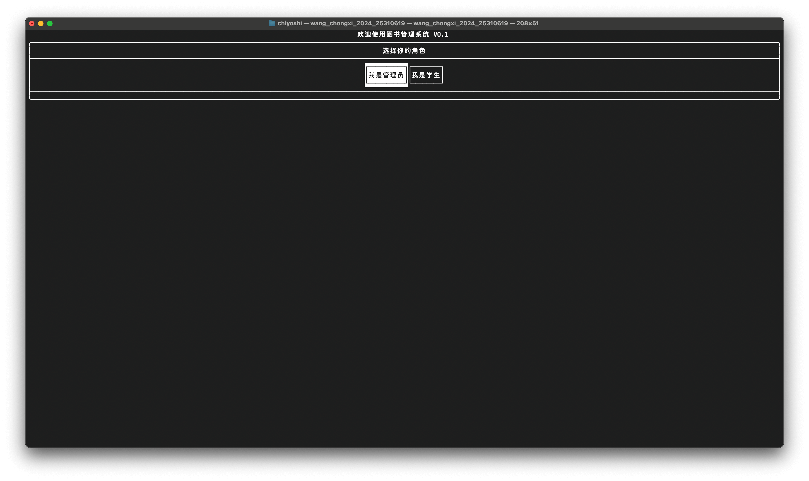
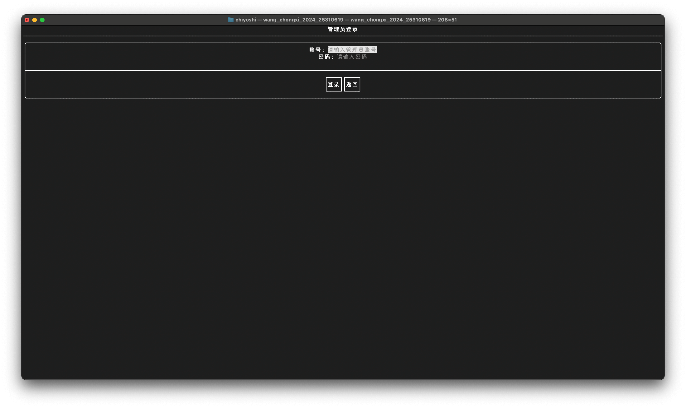
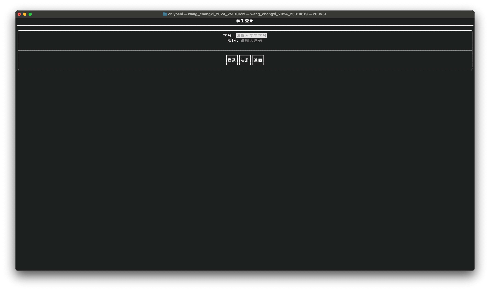
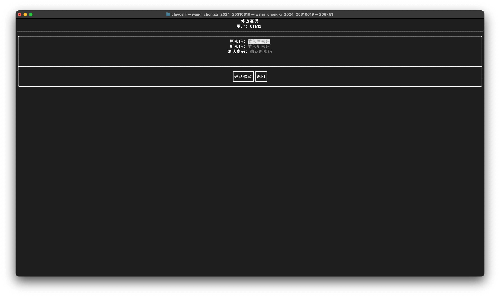
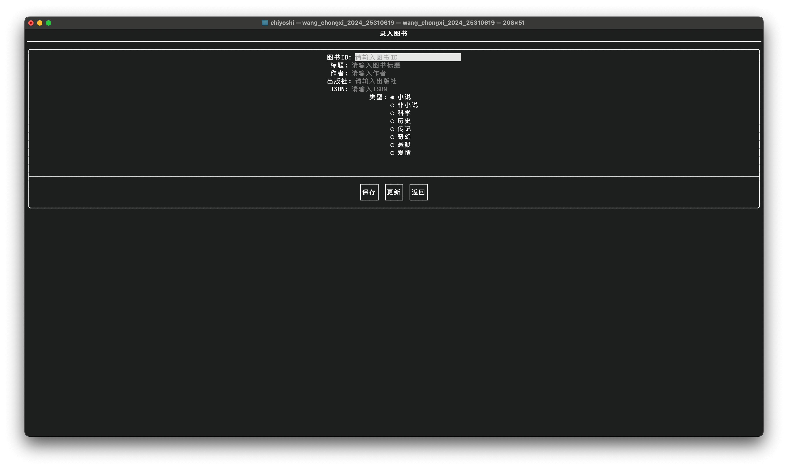
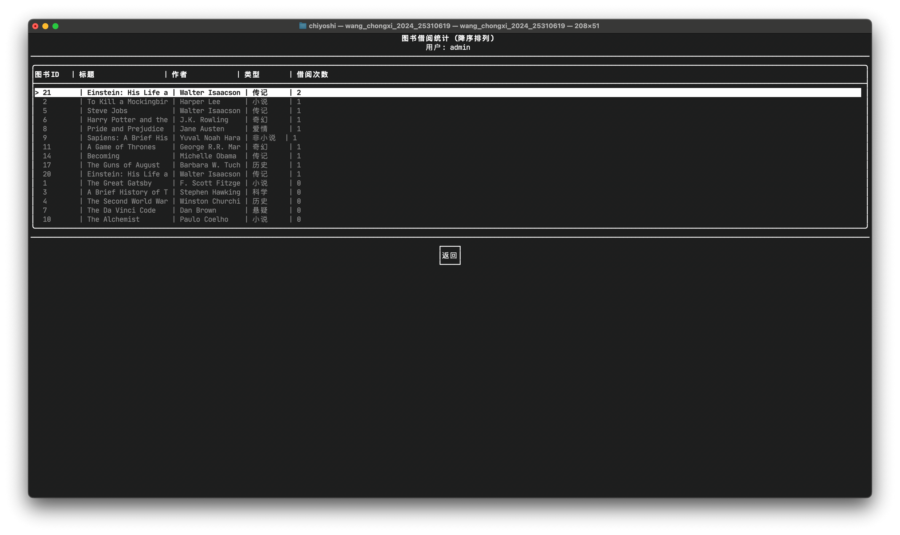
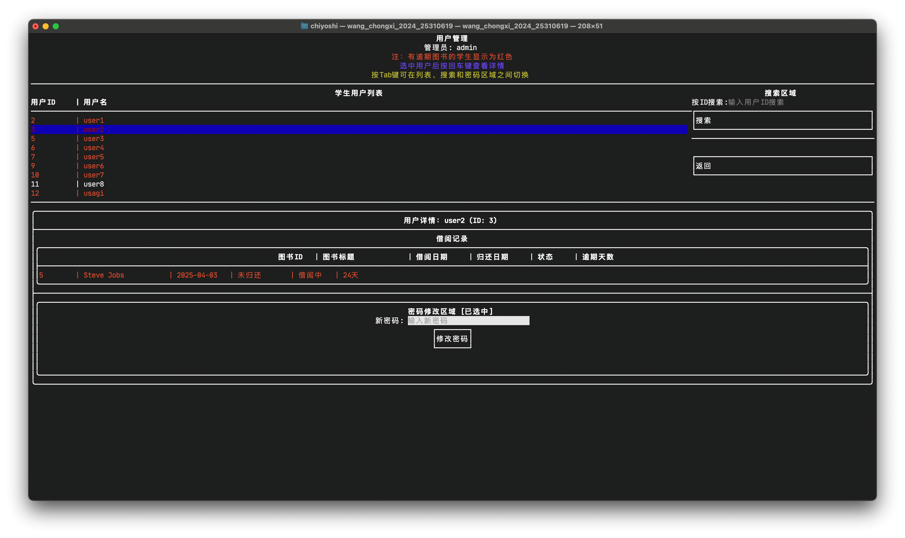

# 一、需求分析

## 1、系统概述

电子图书馆管理系统是基于C语言开发的一款高效图书管理应用程序，旨在实现图书馆的信息化管理，提升图书借阅与管理的便捷性和准确性。该系统通过文件存储实现数据持久化，支持多用户操作，涵盖管理员和学生两种角色。系统主要功能包括：多用户登录验证，确保安全访问；管理员录入、修改、删除图书信息；学生通过图书名称或编号查询图书详情并办理借阅，自动生成归还日期；管理员查询到期或即将到期的借阅记录；统计图书分类、借阅次数及库存情况。此外，系统提供独创DIY功能，如推荐热门图书或用户借阅偏好分析，增强用户体验。程序采用模块化设计，以菜单驱动界面提供清晰的操作提示，支持流程图辅助设计，数据输入时明确提示内容、格式及结束方式。通过文件读写操作，所有信息实现可靠存储与更新，满足现代图书馆管理需求。

## 2、系统运行环境

### （1）硬件环境

- 设备：MacBook Pro (13-inch, 2020, Two Thunderbolt 3 ports)  
- 处理器：2.0 GHz Quad-Core Intel Core i5
- 内存：16 GB 2133 MHz LPDDR3
- 存储：512 GB SSD
- 显卡：Intel Iris Plus Graphics 645  

### （2）软件环境：  
- 操作系统：macOS Sequoia, Version 15.3.2  
- 包管理软件：Homebrew 
- 引入第三方库：ftxui、nlohmannJSON

## 3、功能需求描述：

### （1）登录模块
- **功能概述**：登录模块支持多用户登录，包括管理员和学生两种角色。用户需输入用户名和密码进行身份验证，密码正确方可登录。学生用户还可通过注册功能创建新账号。
- **实现细节**：
  - **管理员登录**：通过 `admin_login_page()` 实现，提供用户名和密码输入框，密码以 `*` 显示，验证失败时显示错误信息，成功后进入管理员仪表板。
  - **学生登录**：通过 `student_login_page()` 实现，提供学号和密码输入框，支持登录和注册功能，验证失败时显示错误信息，成功后进入学生仪表板。
  - **学生注册**：通过 `student_register_page()` 实现，学生可输入学号和密码注册新账号，若用户名已存在则显示错误信息，成功后自动返回主菜单。

### （2）图书管理模块
- **功能概述**：图书管理模块允许管理员录入、修改、删除图书信息，并支持查询图书和借阅状态。
- **实现细节**：
  - **图书录入**：通过 `add_book_page()` 实现，管理员输入图书ID、标题、作者、出版社、ISBN 和类型，点击“保存”或“更新”按钮完成操作，支持输入验证，成功后自动返回图书管理页面。
  - **图书查询**：通过 `search_books_page()` 实现，支持按图书ID或标题搜索，显示图书详细信息，管理员可额外查看借阅者和应还日期。
  - **图书删除**：通过 `delete_book_page()` 实现，管理员输入图书ID执行删除操作，成功后自动返回图书管理页面。
  - **借阅状态查询**：通过 `borrowing_status_page()` 实现，管理员可查看所有未归还图书，或按归还日期查询到期或即将到期的图书，逾期记录以红色高亮。

### （3）学生功能模块
- **功能概述**：学生功能模块支持学生查询图书、借阅图书、查看借阅记录和修改密码。
- **实现细节**：
  - **图书查询**：通过 `search_books_page()` 实现，学生可按ID或标题搜索图书，查看图书状态（可借阅或已借出），但无法查看借阅者信息。
  - **借阅与归还**：通过 `borrow_return_page()` 实现，学生输入图书ID可查询图书状态并执行借阅或归还操作，借阅成功后显示应还日期（15天后），逾期信息以红色高亮。
  - **查看借阅记录**：通过 `my_borrows_page()` 实现，学生可查看所有借阅记录，包括图书信息、借阅时间、应还时间和逾期状态，逾期未还记录以红色高亮，已归还但曾逾期的记录以黄色高亮。
  - **修改密码**：通过 `change_password_page()` 实现，学生输入原密码和新密码进行修改，验证通过后自动返回学生仪表板。

### （4）管理员功能模块
- **功能概述**：管理员功能模块支持用户管理和统计功能。
- **实现细节**：
  - **用户管理**：通过 `manage_users_page()` 实现，管理员可查看学生用户列表、搜索用户、查看用户借阅记录，并为学生重置密码。有逾期未还图书的学生以红色高亮。
  - **统计信息**：通过 `view_stats_page()` 实现，显示所有图书的借阅次数统计，按借阅次数降序排列，包含图书ID、标题、作者、类型和借阅次数。

### （5）DIY功能模块
- **功能概述**：实现了一个创新功能，即图书借阅次数统计和可视化展示，帮助管理员了解图书的受欢迎程度。
- **实现细节**：
  - **借阅次数统计**：通过 `view_stats_page()` 实现，统计每本图书的借阅次数，数据从 `record.json` 文件读取，展示时按借阅次数降序排列，方便管理员分析热门图书。

# 二、系统设计

## 1、总体开发思想：

### （1）主要的数据结构
系统主要使用以下数据结构来管理和组织数据：
- **`std::vector`**：用于动态存储图书、用户和借阅记录的列表。`std::vector` 提供了高效的动态数组操作，支持快速的增删改查，适用于图书列表（`std::vector<book>`）、用户列表（`std::vector<User>`）和借阅记录（`std::vector<record>`）的存储与遍历。
- **`std::map`**：用于快速查找和统计。例如，在统计图书借阅次数时，使用 `std::map<int, int>` 存储图书ID与其借阅次数的映射；在查询图书详情时，使用 `std::map<std::string, book>` 快速定位图书对象。
- **结构体/类**：
  - `book` 类：表示图书实体，包含图书ID、标题、作者、出版社、ISBN、类型和可用状态等属性。
  - `User` 类：表示用户实体，包含用户ID、用户名、密码和角色（管理员或学生）等属性。
  - `record` 类：表示借阅记录，包含图书ID、借阅者ID、借阅时间、归还时间和归还状态等属性。
- **辅助数据结构**：
  - `std::string`：用于存储文本信息，如图书标题、作者名等。
  - `enum`：定义图书类型（如 `FICTION`、`NON_FICTION` 等）和用户角色（如 `ADMIN`、`STUDENT`）。

### （2）系统架构
系统采用模块化设计，分为前端交互层、业务逻辑层和数据存储层：
- **前端交互层**：
  - 使用 `ftxui` 库实现交互式终端界面，提供菜单驱动的用户操作体验。
  - 模块包括：登录页面（`admin_login_page`、`student_login_page`）、图书管理页面（`manage_books_page`）、学生仪表板（`student_dashboard_page`）等。
  - 界面支持输入框、按钮、菜单列表等组件，动态渲染图书列表、借阅记录等信息。
- **业务逻辑层**：
  - 核心功能模块包括登录验证、图书管理、借阅管理、用户管理和统计分析。
  - 每个功能通过独立的函数实现，如 `add_book_page` 负责图书录入，`borrow_return_page` 负责借阅与归还。
  - 逻辑层负责处理用户输入、调用数据层接口，并将结果反馈给前端。
- **数据存储层**：
  - 数据存储在文件系统中，使用 JSON 格式保存图书（`book.json`）、用户（`user.json`）和借阅记录（`record.json`）。
  - 数据操作通过 `book`、`User` 和 `record` 类中的静态方法实现，如 `book::loadAllBooks()`、`record::readFromFile()` 等。
- **模块间交互**：
  - 前端通过调用业务逻辑层函数（如 `User::authenticate`）实现登录验证。
  - 业务逻辑层通过数据存储层接口（如 `book::addBook`）完成数据读写。
  - 数据以对象形式在各层间传递，例如 `book` 对象从存储层加载后传递到逻辑层，再由前端渲染。

### （3）数据存储方式
系统采用 **Vector + 文件读写 + JSON** 的方式进行数据存储和交换：
- **存储介质**：
  - 数据存储在本地文件系统中，分别使用以下文件：
    - `books/book.json`：存储所有图书信息。
    - `users/user.json`：存储所有用户信息。
    - `records/record.json`：存储所有借阅记录。
- **数据格式**：
  - 使用 JSON 格式存储数据，利用 `nlohmann/json` 库进行序列化和反序列化。
  - 示例：
    - 图书记录：`{"bookId": "1", "title": "C++ Primer", "author": "Stanley B. Lippman", ...}`
    - 用户记录：`{"id": 1, "username": "admin", "password": "admin123", "role": "ADMIN"}`
    - 借阅记录：`{"bookID": 1, "borrowerID": 2, "borrowTime": 1625097600, "returnTime": 0}`
- **读写操作**：
  - **读取**：通过 `std::ifstream` 读取 JSON 文件，使用 `nlohmann::json` 解析为对象列表。例如，`book::loadAllBooks()` 读取 `book.json` 并返回 `std::vector<book>`。
  - **写入**：通过 `std::ofstream` 将对象列表序列化为 JSON 格式并写入文件。例如，`book::saveToFile()` 将更新后的图书列表写入 `book.json`。
- **数据管理**：
  - 使用 `std::vector` 在内存中临时存储数据，程序启动时从文件加载，操作完成后写入文件，确保数据持久化。
  - 每次操作（如添加图书、借阅图书）都会重新加载和保存文件，确保数据一致性。

### （4）使用的语言
- **编程语言**：C++（标准：C++11 及以上）。
- **第三方库**：
  - **`ftxui`**：用于构建交互式终端界面，提供输入框、按钮、菜单等组件，支持动态渲染和事件处理。
  - **`nlohmann/json`**：用于 JSON 数据序列化和反序列化，支持将 C++ 对象与 JSON 文件相互转换。
- **开发工具**：
  - 编译器：G++。
  - IDE：CLion、VSCode、Trae。
- **文件操作**：使用 C++ 标准库 `<fstream>` 实现文件读写。
- **时间处理**：使用 `<ctime>` 管理借阅时间、归还时间和逾期计算。
- **其他**：使用 `<vector>`、`<map>`、`<algorithm>` 等标准库组件进行数据管理和排序。


## 2、系统模块结构图


### 说明
- **层次划分**：
  - **前端交互层**：包含登录模块、图书管理模块、学生功能模块和管理员功能模块，负责用户界面交互。
  - **业务逻辑层**：包含用户管理、图书管理、借阅管理和统计分析模块，处理核心逻辑。
  - **数据存储层**：包含图书数据、用户数据和借阅记录模块，负责数据持久化。
- **数据流**：箭头表示各模块间的依赖关系，例如登录模块调用用户管理的认证功能，图书管理模块依赖图书数据的读写。

## 3、模块设计

### 1、用户登录注册模块

#### 管理员登录流程 (`admin_login_page`)


#### 学生登录流程 (`student_login_page`)


#### 学生注册流程 (`student_register_page`)


### 2、管理员图书管理模块

#### 图书管理主页面流程 (`manage_books_page`)


#### 查询图书页面流程 (`search_books_page`)


#### 借阅情况页面流程 (`borrowing_status_page`)


录入图书页面流程 (`add_book_page`)


#### 删除图书页面流程 (`delete_book_page`)


#### 说明
- **图书管理主页面流程**：展示了 `manage_books_page` 的功能选项，包括查询、借阅情况、录入和删除，以及返回管理员仪表板。
- **查询图书页面流程**：描述了 `search_books_page` 的搜索功能，支持按ID或标题查询，并返回结果或提示无结果。
- **借阅情况页面流程**：描述了 `borrowing_status_page` 的功能，展示未归还记录并支持按日期查询。
- **录入图书页面流程**：描述了 `add_book_page` 的录入和更新功能，包括输入验证和保存/更新逻辑。
- **删除图书页面流程**：描述了 `delete_book_page` 的删除功能，包含验证和文件更新。

### 3、管理员用户管理模块流程图

#### 用户管理主页面流程 (`manage_users_page`)


#### 查看用户列表页面流程


#### 搜索用户页面流程 (`search_users_page`)


#### 重置密码页面流程 (`reset_password_page`)


#### 说明
- **用户管理主页面流程**：展示了 `manage_users_page` 的功能选项，包括查看用户列表、搜索用户和重置密码，以及返回管理员仪表板。
- **查看用户列表页面流程**：描述了用户列表的加载和显示功能，突出显示逾期未还用户的红色高亮。
- **搜索用户页面流程**：描述了 `search_users_page` 的搜索功能，支持按ID或用户名查询，并返回结果或提示无结果。
- **重置密码页面流程**：描述了 `reset_password_page` 的重置功能，包括用户验证和密码重置逻辑。

### 4、 管理员统计信息模块流程图

#### 统计信息主页面流程 (`view_stats_page`)


#### 借阅次数统计页面流程


#### 可视化展示页面流程 (`visualize_stats_page`)


#### 说明
- **统计信息主页面流程**：展示了 `view_stats_page` 的功能选项，包括查看借阅次数统计和可视化展示，以及返回管理员仪表板。
- **借阅次数统计页面流程**：描述了借阅次数统计功能，从文件加载数据，按借阅次数降序排列并展示结果。
- **可视化展示页面流程**：描述了 `visualize_stats_page` 的可视化功能，基于借阅次数数据生成柱状图（假设使用字符画或 FTXUI 组件展示）。

### 5、学生用户搜索图书模块流程图

#### 搜索图书页面流程 (`search_books_page`)


#### 查看图书状态子页面流程


#### 说明
- **搜索图书页面流程**：展示了 `search_books_page` 的学生用户搜索图书功能，支持按ID或标题搜索，显示结果（不含借阅者信息）或提示无结果，并允许返回学生仪表板。
- **查看图书状态子页面流程**：描述了查看图书状态的子页面，显示图书是否可借阅，学生用户无法查看借阅者信息。

### 6、学生用户我的借阅模块流程图

#### 我的借阅主页面流程 (`my_borrows_page`)


#### 查看借阅记录页面流程


#### 筛选逾期记录页面流程 (`filter_overdue_page`)

```mermaid
flowchart TD
    A[开始] --> B[显示筛选逾期记录页面]
    B --> C[加载学生借阅记录<br>record::readFromFile]
    C --> D[筛选逾期记录<br>record::isOverdue]
    D --> E[显示逾期记录<br>包括图书信息、借阅时间、应还时间]
    E --> F[逾期记录以红色高亮]
    F --> G[点击返回按钮]
    G --> H[返回我的借阅页面<br>my_borrows_page]
    H --> I[结束]

    %% 样式
    classDef default fill:#e0f2f1,stroke:#00897b,stroke-width:2px;
    class A,B,C,D,E,F,G,H,I default;
```

#### 说明
- **我的借阅主页面流程**：展示了 `my_borrows_page` 的功能选项，包括查看所有借阅记录和筛选逾期记录，以及返回学生仪表板。
- **查看借阅记录页面流程**：描述了加载和显示学生所有借阅记录的功能，突出逾期未还（红色）和曾逾期已归还（黄色）记录。
- **筛选逾期记录页面流程**：描述了 `filter_overdue_page` 的筛选功能，仅显示逾期记录并以红色高亮。

### 7、学生用户借书还书模块流程图

#### 借书还书主页面流程 (`borrow_return_page`)

```mermaid
flowchart TD
    A[开始] --> B[显示借书还书页面]
    B --> C[输入图书ID]
    C --> D[点击查询按钮]
    D --> E{查询图书状态<br>book::findBookById}
    E -->|找到| F[显示图书状态<br>可借阅或已借出]
    E -->|未找到| G[显示无结果提示]
    G --> C
    F --> H[选择操作]
    H --> I[点击借书按钮]
    I --> J[跳转到借书页面]
    H --> K[点击还书按钮]
    K --> L[跳转到还书页面<br>return_book_page]
    H --> M[点击返回按钮]
    M --> N[返回学生仪表板<br>student_dashboard_page]
    J --> O[结束]
    L --> O
    N --> O

    %% 样式
    classDef default fill:#f3e5f5,stroke:#8e24aa,stroke-width:2px;
    class A,B,C,D,E,F,G,H,I,J,K,L,M,N,O default;
```

#### 借书页面流程

```mermaid
flowchart TD
    A[开始] --> B[显示借书页面]
    B --> C{检查图书状态<br>book::isAvailable}
    C -->|可借阅| D[记录借阅信息<br>record::addBorrowRecord]
    D --> E[设置应还日期<br>15天后]
    E --> F[显示借阅成功信息<br>包括应还日期]
    C -->|已借出| G[显示提示<br>图书已被借出]
    G --> H[点击返回按钮]
    F --> H
    H --> I[返回借书还书页面<br>borrow_return_page]
    I --> J[结束]

    %% 样式
    classDef default fill:#f3e5f5,stroke:#8e24aa,stroke-width:2px;
    class A,B,C,D,E,F,G,H,I,J default;
```

#### 还书页面流程 (`return_book_page`)

```mermaid
flowchart TD
    A[开始] --> B[显示还书页面]
    B --> C{检查借阅记录<br>record::isBookBorrowedByUser}
    C -->|是本人借阅| D[更新借阅记录<br>record::addReturnRecord]
    D --> E{检查是否逾期<br>record::isOverdue}
    E -->|是| F[显示逾期信息<br>以红色高亮]
    E -->|否| G[显示正常归还信息]
    C -->|不是本人借阅| H[显示提示<br>非本人借阅或未借阅]
    H --> I[点击返回按钮]
    F --> I
    G --> I
    I --> J[返回借书还书页面<br>borrow_return_page]
    J --> K[结束]

    %% 样式
    classDef default fill:#f3e5f5,stroke:#8e24aa,stroke-width:2px;
    class A,B,C,D,E,F,G,H,I,J,K default;
```

#### 说明
- **借书还书主页面流程**：展示了 `borrow_return_page` 的功能，学生输入图书ID后可查询图书状态，并选择借书或还书操作。
- **借书页面流程**：描述了借书功能，检查图书是否可借阅，记录借阅信息并设置应还日期（15天后）。
- **还书页面流程**：描述了 `return_book_page` 的还书功能，验证是否为本人借阅，更新记录并显示逾期状态（逾期以红色高亮）。

### 8、学生用户修改密码模块流程图

#### 修改密码主页面流程 (`change_password_page`)

```mermaid
flowchart TD
    A[开始] --> B[显示修改密码页面]
    B --> C[输入原密码和新密码]
    C --> D[点击确认修改按钮]
    D --> E[跳转到验证页面]
    C --> F[点击返回按钮]
    F --> G[返回学生仪表板<br>student_dashboard_page]
    E --> H[结束]
    G --> H

    %% 样式
    classDef default fill:#e1f5fe,stroke:#0277bd,stroke-width:2px;
    class A,B,C,D,E,F,G,H default;
```

#### 验证和修改密码页面流程

```mermaid
flowchart TD
    A[开始] --> B[验证原密码<br>User::authenticate]
    B -->|正确| C{验证新密码<br>检查是否为空}
    B -->|错误| D[显示错误信息<br>原密码错误]
    D --> E[返回修改密码页面<br>change_password_page]
    C -->|不通过| F[显示错误信息<br>新密码不能为空]
    F --> E
    C -->|通过| G[更新密码<br>User::changePassword]
    G -->|成功| H[显示成功信息<br>延迟800ms返回]
    G -->|失败| I[显示错误信息<br>修改失败]
    I --> E
    H --> J[返回学生仪表板<br>student_dashboard_page]
    E --> K[结束]
    J --> K

    %% 样式
    classDef default fill:#e1f5fe,stroke:#0277bd,stroke-width:2px;
    class A,B,C,D,E,F,G,H,I,J,K default;
```

#### 说明
- **修改密码主页面流程**：展示了 `change_password_page` 的功能，学生输入原密码和新密码后可选择确认修改或返回。
- **验证和修改密码页面流程**：描述了验证原密码、检查新密码合法性以及更新密码的流程，成功后返回学生仪表板，失败则返回修改页面。

# 三、功能实现

## 1、主要函数：函数名及参数含义

### (1) User

#### 成员变量
- `int id`：用户ID，用于唯一标识每个用户。
- `std::string name`：用户名，用于登录和身份识别。
- `std::string password`：用户密码，用于身份验证。
- `Role userRole`：用户角色，枚举类型（`ADMIN` 或 `STUDENT`），表示用户权限。

#### 成员函数
- `User()`：默认构造函数，初始化 `id` 为 0，`name` 和 `password` 为空字符串，`userRole` 默认设置为 `STUDENT`。
- `User(int id, const std::string& name, const std::string& password, Role role)`：带参数的构造函数，初始化用户对象，参数分别为用户ID、用户名、密码和角色。
- `int getId() const`：获取用户ID，返回 `int` 类型。
- `std::string getName() const`：获取用户名，返回 `std::string` 类型。
- `std::string getPassword() const`：获取用户密码，返回 `std::string` 类型。
- `Role getRole() const`：获取用户角色，返回 `Role` 枚举类型。
- `void setId(int id)`：设置用户ID，参数为新的 `id` 值。
- `void setName(const std::string& name)`：设置用户名，参数为新的 `name` 值。
- `void setPassword(const std::string& password)`：设置用户密码，参数为新的 `password` 值。
- `void setRole(Role role)`：设置用户角色，参数为新的 `role` 值。
- `json toJson() const`：将用户对象转换为 JSON 格式，返回 `json` 对象，包含 `id`、`name`、`password` 和角色（字符串形式 `ADMIN` 或 `STUDENT`）。
- `void fromJson(const json& j)`：从 JSON 对象中加载用户数据，参数为 `json` 对象，更新 `id`、`name`、`password` 和 `userRole`。
- `std::vector<User> loadFromFile(const std::string& filename)`：从指定文件加载用户数据，参数为文件名（`std::string`），返回 `std::vector<User>`，读取 JSON 文件并解析为用户列表。
- `std::vector<User> loadAllUsers()`：加载所有用户数据，返回 `std::vector<User>`，从特定路径的 `user.json` 文件加载。
- `bool saveToFile(const std::vector<User>& users, const std::string& filename)`：将用户列表保存到指定文件，参数分别为用户列表（`std::vector<User>`）和文件名（`std::string`），返回 `bool` 表示成功与否。
- `User* authenticate(const std::string& username, const std::string& password)`：验证用户身份，参数分别为用户名和密码（`std::string`），返回指向 `User` 对象的指针，若验证失败返回 `nullptr`。
- `bool registerUser(const std::string& username, const std::string& password, Role role)`：注册新用户，参数分别为用户名、密码和角色（`Role`），返回 `bool` 表示注册成功与否。
- `bool changePassword(int userId, const std::string& oldPassword, const std::string& newPassword)`：修改用户密码，参数分别为用户ID、原密码和新密码（`std::string`），返回 `bool` 表示修改成功与否。
- `bool adminChangeUserPassword(int adminId, int userId, const std::string& newPassword)`：管理员修改其他用户密码，参数分别为管理员ID、目标用户ID和新密码（`std::string`），返回 `bool` 表示修改成功与否。
- `User* findUserById(int userId)`：根据ID查找用户，参数为用户ID（`int`），返回指向 `User` 对象的指针，若未找到返回 `nullptr`。

### (2) Book

#### 成员变量
- `std::string bookId`：图书的唯一标识符。
- `std::string title`：图书标题。
- `std::string author`：图书作者。
- `type bookType`：图书类型，枚举类型（`FICTION`、`NON_FICTION`、`SCIENCE`、`HISTORY`、`BIOGRAPHY`、`FANTASY`、`MYSTERY`、`ROMANCE`）。
- `std::string publisher`：图书出版社。
- `std::string isbn`：图书的国际标准书号（ISBN）。
- `bool isAvailable`：图书是否可借阅的状态。

#### 成员函数
- `book()`：默认构造函数，初始化 `bookId`、`title`、`author` 为空字符串，`bookType` 默认设置为 `FICTION`，`publisher`、`isbn` 为空字符串，`isAvailable` 默认设置为 `true`。
- `book(const std::string& id, const std::string& title, const std::string& author, type bookType, const std::string& publisher, const std::string& isbn, bool isAvailable)`：带参数的构造函数，初始化图书对象，参数分别为图书ID、标题、作者、类型、出版社、ISBN 和是否可借阅。
- `std::string getBookId() const`：获取图书ID，返回 `std::string` 类型。
- `std::string getTitle() const`：获取图书标题，返回 `std::string` 类型。
- `std::string getAuthor() const`：获取图书作者，返回 `std::string` 类型。
- `type getBookType() const`：获取图书类型，返回 `type` 枚举类型。
- `std::string getPublisher() const`：获取图书出版社，返回 `std::string` 类型。
- `std::string getIsbn() const`：获取图书ISBN，返回 `std::string` 类型。
- `bool getIsAvailable() const`：获取图书是否可借阅的状态，返回 `bool` 类型。
- `void setBookId(const std::string& id)`：设置图书ID，参数为新的 `id` 值。
- `void setTitle(const std::string& title)`：设置图书标题，参数为新的 `title` 值。
- `void setAuthor(const std::string& author)`：设置图书作者，参数为新的 `author` 值。
- `void setBookType(type bookType)`：设置图书类型，参数为新的 `bookType` 值。
- `void setPublisher(const std::string& publisher)`：设置图书出版社，参数为新的 `publisher` 值。
- `void setIsbn(const std::string& isbn)`：设置图书ISBN，参数为新的 `isbn` 值。
- `void setIsAvailable(bool available)`：设置图书是否可借阅的状态，参数为新的 `available` 值。
- `json toJson() const`：将图书对象转换为 JSON 格式，返回 `json` 对象，包含 `bookId`、`title`、`author`、`publisher`、`isbn`、`isAvailable` 和 `bookType`（字符串形式）。
- `void fromJson(const json& j)`：从 JSON 对象中加载图书数据，参数为 `json` 对象，更新 `bookId`、`title`、`author`、`publisher`、`isbn`、`isAvailable` 和 `bookType`。
- `std::vector<book> loadFromFile(const std::string& filename)`：从指定文件加载图书数据，参数为文件名（`std::string`），返回 `std::vector<book>`，读取 JSON 文件并解析为图书列表。
- `std::vector<book> loadAllBooks()`：加载所有图书数据，返回 `std::vector<book>`，从特定路径的 `book.json` 文件加载。
- `bool saveToFile(const std::vector<book>& books, const std::string& filename)`：将图书列表保存到指定文件，参数分别为图书列表（`std::vector<book>`）和文件名（`std::string`），返回 `bool` 表示成功与否。
- `bool addBook(const book& newBook)`：添加新图书，参数为新的图书对象（`book`），检查ID或ISBN是否重复，返回 `bool` 表示添加成功与否。
- `book* findBookById(const std::string& id)`：根据ID查找图书，参数为图书ID（`std::string`），返回指向 `book` 对象的指针，若未找到返回 `nullptr`。
- `bool updateBook(const book& updatedBook)`：更新图书信息，参数为更新后的图书对象（`book`），返回 `bool` 表示更新成功与否。

### (3) Record

#### 成员变量
- `int borrowerID`：借阅者的ID，用于标识借阅人。
- `int bookID`：图书的ID，用于标识被借阅的图书。
- `time_t borrowTime`：借阅时间，记录借阅发生的 UNIX 时间戳。
- `time_t returnTime`：归还时间，记录归还发生的 UNIX 时间戳，默认为 0 表示未归还。

#### 成员函数
- `record()`：默认构造函数，初始化 `borrowerID`、`bookID` 和 `returnTime` 为 0，`borrowTime` 为 0。
- `record(int borrowerID, int bookID, time_t borrowTime)`：借书记录构造函数，初始化借阅记录，参数分别为借阅者ID、图书ID和借阅时间。
- `int getBorrowerID() const`：获取借阅者ID，返回 `int` 类型。
- `int getBookID() const`：获取图书ID，返回 `int` 类型。
- `time_t getBorrowTime() const`：获取借阅时间，返回 `time_t` 类型。
- `time_t getReturnTime() const`：获取归还时间，返回 `time_t` 类型。
- `void setBorrowerID(int id)`：设置借阅者ID，参数为新的 `id` 值。
- `void setBookID(int id)`：设置图书ID，参数为新的 `id` 值。
- `void setBorrowTime(time_t time)`：设置借阅时间，参数为新的 `time` 值。
- `void setReturnTime(time_t time)`：设置归还时间，参数为新的 `time` 值。
- `bool isReturned() const`：判断借阅记录是否已归还，返回 `bool` 类型（`returnTime != 0` 表示已归还）。
- `void returnBook()`：设置归还时间为当前时间，用于记录归还操作。
- `bool isOverdue() const`：检查借阅是否逾期，借阅期为 15 天，返回 `bool` 类型（已归还时检查是否逾期，未归还时检查当前是否逾期）。
- `int getOverdueDays() const`：获取逾期天数，借阅期为 15 天，返回 `int` 类型（若未逾期返回 0，逾期天数向上取整）。
- `time_t getDueDate() const`：获取应还日期，计算为借阅时间加 15 天，返回 `time_t` 类型。
- `std::vector<record> getOverdueRecords(const std::vector<record>& records)`：获取所有逾期记录，参数为记录列表（`std::vector<record>`），返回逾期记录的向量。
- `bool willBeOverdueSoon(int days) const`：检查借阅是否即将逾期，参数为预警天数（`int`），返回 `bool` 类型（未逾期且剩余时间小于预警天数）。
- `std::vector<record> getSoonOverdueRecords(const std::vector<record>& records, int days)`：获取即将逾期的记录，参数分别为记录列表（`std::vector<record>`）和预警天数（`int`），返回即将逾期记录的向量。
- `std::vector<record> getBooksWithDueAfterDate(time_t date, const std::vector<record>& records)`：根据日期查询该日期之后到期的书籍，参数分别为日期（`time_t`）和记录列表（`std::vector<record>`），返回匹配记录的向量。
- `std::vector<record> getBooksWithDueAfterDateFromFile(time_t date, const std::string& filename)`：从文件中查询该日期之后到期的书籍，参数分别为日期（`time_t`）和文件名（`std::string`），返回匹配记录的向量。
- `std::vector<record> getOverdueUnreturnedRecords(const std::vector<record>& records)`：获取所有逾期未归还的书籍记录，参数为记录列表（`std::vector<record>`），返回匹配记录的向量。
- `std::vector<record> getOverdueUnreturnedRecordsFromFile(const std::string& filename)`：从文件中获取所有逾期未归还的书籍记录，参数为文件名（`std::string`），返回匹配记录的向量。
- `json toJson() const`：将记录对象转换为 JSON 格式，返回 `json` 对象，包含 `borrowerID`、`bookID`、`borrowTime` 和 `returnTime`。
- `record fromJson(const json& j)`：从 JSON 对象中加载记录数据，参数为 `json` 对象，返回 `record` 对象。
- `std::vector<record> readFromFile(const std::string& filename)`：从 JSON 文件读取所有记录，参数为文件名（`std::string`），返回记录列表（`std::vector<record>`）。
- `void writeToFile(const std::vector<record>& records, const std::string& filename)`：将记录列表写入 JSON 文件，参数分别为记录列表（`std::vector<record>`）和文件名（`std::string`）。
- `void addBorrowRecord(int borrowerID, int bookID, const std::string& filename)`：添加借阅记录并保存到文件，参数分别为借阅者ID、图书ID和文件名（`std::string`），检查图书是否已被借出并更新图书可用性。
- `bool addReturnRecord(int borrowerID, int bookID, const std::string& filename)`：添加归还记录并保存到文件，参数分别为借阅者ID、图书ID和文件名（`std::string`），返回 `bool` 表示成功与否。
- `std::vector<record> getUserRecords(int userID, const std::vector<record>& records)`：获取用户的所有借阅记录，参数分别为用户ID（`int`）和记录列表（`std::vector<record>`），返回匹配记录的向量。
- `std::vector<record> getUserRecordsFromFile(int userID, const std::string& filename)`：从文件中获取用户的所有借阅记录，参数分别为用户ID（`int`）和文件名（`std::string`），返回匹配记录的向量。
- `std::vector<record> getBookRecords(int bookID, const std::vector<record>& records)`：获取图书的所有借阅记录，参数分别为图书ID（`int`）和记录列表（`std::vector<record>`），返回匹配记录的向量。
- `std::vector<record> getUnreturnedRecords(const std::vector<record>& records)`：获取当前未归还的记录，参数为记录列表（`std::vector<record>`），返回未归还记录的向量。
- `bool isBookBorrowed(int bookID, const std::vector<record>& records)`：检查图书是否已被借出，参数分别为图书ID（`int`）和记录列表（`std::vector<record>`），返回 `bool` 类型。
- `bool hasUserBorrowedBook(int userID, int bookID, const std::vector<record>& records)`：检查用户是否已借此书，参数分别为用户ID、图书ID和记录列表（`std::vector<record>`），返回 `bool` 类型。
- `bool hasUserReturnedAllBooks(int userID, const std::vector<record>& records)`：检查用户是否已归还所有借阅的图书，参数分别为用户ID和记录列表（`std::vector<record>`），返回 `bool` 类型。
- `bool isBookReturned(int bookID, const std::vector<record>& records)`：判断图书是否已归还，参数分别为图书ID和记录列表（`std::vector<record>`），返回 `bool` 类型。
- `std::string formatTime(time_t time)`：格式化显示时间，参数为时间戳（`time_t`），返回格式化后的时间字符串（`YYYY-MM-DD HH:MM:SS` 或 `未归还`）。
- `void printRecord() const`：打印记录信息，显示借阅者ID、图书ID、借阅时间、归还时间和状态。
- `std::map<int, int> getBookBorrowCounts(const std::vector<record>& records)`：统计书籍借阅次数，参数为记录列表（`std::vector<record>`），返回图书ID与借阅次数的映射（`std::map<int, int>`）。
- `std::map<int, int> getBookBorrowCountsFromFile(const std::string& filename)`：从文件中统计书籍借阅次数，参数为文件名（`std::string`），返回图书ID与借阅次数的映射（`std::map<int, int>`）。

## 2、使用界面

### (1) 主页面  
主页面是程序的入口，用户可以选择以管理员或学生身份登录，或者退出程序。界面显示简单的菜单选项，引导用户进入登录流程。  


### (2) 管理员登录页面  
管理员登录页面允许管理员输入用户名和密码进行身份验证，密码以 `*` 显示。验证成功后进入管理员仪表板，失败则显示错误信息。  


### (3) 学生登录页面  
学生登录页面支持学生输入学号和密码进行登录，密码以 `*` 显示。学生可以选择登录或跳转到注册页面，验证失败时显示错误信息。  


### (4) 学生注册页面  
学生注册页面允许学生输入学号和密码创建新账号。如果学号已存在或输入不合法，界面会显示错误信息；注册成功后自动返回主菜单。  


### (5) 管理员仪表板页面  
管理员仪表板页面是管理员登录成功后的主界面，提供图书管理、用户管理和统计信息等功能入口，管理员可通过菜单选择具体操作。  


### (6) 学生仪表板页面  
学生仪表板页面是学生登录成功后的主界面，提供图书查询、借书还书、查看借阅记录和修改密码等功能入口，学生可通过菜单选择操作。  


### (7) 图书搜索页面  
图书搜索页面允许用户（学生和管理员）输入图书ID或标题进行搜索。学生只能查看图书基本信息和借阅状态，管理员可额外查看借阅者信息。  


### (8) 学生借书还书页面  
学生借书还书页面支持学生输入图书ID查询图书状态并执行借书或还书操作。借书成功后显示应还日期，逾期信息以红色高亮。  


### (9) 学生借阅记录页面  
学生借阅记录页面展示学生的所有借阅记录，包括图书信息、借阅时间、应还时间和状态。逾期未还记录以红色高亮，已归还但曾逾期的以黄色高亮。  


### (10) 学生修改密码页面  
学生修改密码页面允许学生输入原密码和新密码进行修改。验证通过后自动返回学生仪表板，失败则提示错误信息。  


### (11) 管理员图书管理页面  
管理员图书管理页面是管理员管理图书的入口，提供录入图书、查询图书、删除图书和查看借阅状态等功能选项。  


### (12) 管理员录入图书页面  
管理员录入图书页面允许管理员输入图书ID、标题、作者、出版社、ISBN 和类型等信息，点击保存或更新完成操作，成功后返回图书管理页面。  


### (13) 管理员删除图书页面  
管理员删除图书页面支持管理员输入图书ID执行删除操作，成功后自动返回图书管理页面，失败则提示错误信息。  


### (14) 管理员借阅状态页面  
管理员借阅状态页面展示所有未归还图书的借阅记录，支持按归还日期查询到期或即将到期的图书，逾期记录以红色高亮。  


### (15) 管理员用户管理页面  
管理员用户管理页面允许管理员查看学生用户列表、搜索用户、查看用户借阅记录，并为学生重置密码，逾期未还用户以红色高亮。  


### (16) 管理员统计信息页面  
管理员统计信息页面展示所有图书的借阅次数统计，按借阅次数降序排列，包含图书ID、标题、作者、类型和借阅次数。  


# 四、AI辅助编码

## (1) 简述本项目中采用AI辅助设计的过程  
在完成这个图书管理系统项目时，我尝试了用AI来帮我设计和优化代码，尤其是在开始时有点不知道从哪里下手的时候。我先是把自己的项目想法告诉了AI，比如说想做一个支持管理员和学生操作的系统，包括登录、图书管理、借阅记录等等。AI帮我梳理了思路，建议我用模块化的结构，把功能分成用户管理、图书管理和借阅记录几个部分，还推荐了一些数据存储方式，比如用JSON文件和vector来管理数据。整个过程就像有个“智能助手”陪着我一起头脑风暴，我一边提出需求，AI一边给出建议，我再根据自己的理解调整，最后形成了现在的项目框架。

## (2) 详述在哪些功能采用了AI辅助设计  
AI在很多具体功能上都帮了我大忙。比如，在用户登录和注册模块里，AI帮我设计了验证逻辑和文件读写的代码，特别是用`User`类来处理身份认证和密码修改时，AI给出了清晰的函数结构。图书管理模块里，AI帮我实现了`book`类的增删改查功能，比如`addBook`和`findBookById`这些函数，代码逻辑很直观。借阅记录的部分，AI还协助我设计了逾期检查和统计功能，比如`isOverdue`和`getBookBorrowCounts`，这些让我省了不少时间去自己摸索。界面设计上，AI根据我的项目树里的图片命名，帮我整理了使用说明的顺序和内容，甚至还生成了Mermaid图来可视化流程，比如登录和图书管理的流程图，这让我在写报告时也更有条理。

## (3) AI辅助设计的优点  
用AI辅助设计真的让我受益匪浅。首先，它大大提高了我的开发效率，特别是在写一些复杂的逻辑时，AI能快速给出模板代码，我只要稍微改改就行，省去了很多试错时间。其次，AI提供的结构化建议让我学会了更好地组织代码，比如模块化和数据持久化的思路，这对我理解C++编程很有帮助。最后，AI还能生成可视化的流程图和文档内容，这让我在整理项目报告时事半功倍，感觉自己的表达也更清晰了。总的来说，AI就像个贴心的老师，帮我少走了很多弯路。

## (4) 目前存在的问题  
不过，AI辅助也不是完美无缺的。有时候AI给的代码需要我自己去理解和调试，比如文件路径硬编码到代码里（像`/Users/chiyoshi/...`），这让我觉得不够灵活，得手动改成更通用的方式。还有，AI生成的Mermaid图虽然好看，但细节上有时候跟我的实际需求不太吻合，我得自己调整才能完全符合项目逻辑。另外，AI有时候会假设一些我没提到的功能，比如统计功能的具体实现，我得花时间确认这些是否必要。总的来说，AI很强大，但还是得靠我自己多检查和优化，才能让项目更完善。

# 五、总结

在今年的4月初，当我得知需要完成这个结构化程序设计项目时，我决定挑战自己，开发一个电子图书馆管理系统。虽然这不是我第一次写软件——之前我主导过一个比较大型的Java项目，积累了一些开发经验——但这次用C++完成一个完整的系统对我来说仍然是个不小的挑战。整个开发过程充满了探索和成长，下面我来回顾一下这段经历。

一开始，我对如何设计这个系统感到有些迷茫。虽然我有Java开发的经验，但C++的开发方式和内存管理让我有些不太适应。加上这次是我一个人独立完成，没有队友可以讨论，我只能靠自己摸索。我先花了几天时间梳理需求，明确了系统的核心功能：支持管理员和学生两种角色，管理员可以管理图书和用户，学生可以借书还书、查询记录，还要加上一些统计功能。我参考了课程讲义和网上的资料，确定了用模块化设计的思路，把系统分成用户管理、图书管理和借阅记录三个主要模块。

为了更清晰地规划程序逻辑，我决定先画出系统的流程图。我用Mermaid工具画了登录、图书管理和借阅流程的图，比如管理员登录和学生借书的流程图，这些图让我对每个模块的交互有了直观的认识。画完流程图后，我开始设计数据结构。因为系统需要持久化存储，我选择了用JSON文件结合`std::vector`来管理数据，同时用`book`、`User`和`record`三个类来封装核心实体。这样的设计让我在编码时更清晰，比如`book`类负责图书的增删改查，`record`类处理借阅记录和逾期逻辑。

在编码阶段，我从用户登录模块入手，实现了`User`类的认证和注册功能。因为之前写过Java项目，我对面向对象的思想比较熟悉，所以用C++写类和方法时上手还算顺利。不过，C++的文件操作让我花了不少时间调试，比如用`nlohmann/json`库读写JSON文件时，我一开始没处理好异常，导致程序经常崩溃。后来我仔细阅读了库的文档，学会了用`try-catch`来捕获错误，问题才解决。图书管理模块的开发相对顺利，`book`类的`addBook`和`findBookById`函数逻辑比较简单，我很快就完成了增删改查的功能。

借阅记录模块是整个项目的难点之一。我需要实现逾期检查、统计借阅次数等功能，这些逻辑比我预想的复杂。比如，`record`类的`isOverdue`函数要计算借阅时间和当前时间的差值，还要处理已归还和未归还两种情况。我一开始写错了时间计算逻辑，导致逾期天数总是出错。后来我仔细检查了代码，发现是时间戳转换的问题，改用`time_t`和`<ctime>`库后才正常工作。统计功能的实现也让我颇费心思，`getBookBorrowCounts`函数需要遍历所有借阅记录，我用`std::map`来存储图书ID和借阅次数的映射，最后再按次数排序展示。

界面设计是我花时间最多的部分。我用了`ftxui`库来实现交互式终端界面，希望让用户操作更直观。主页面、登录页面、仪表板页面等都是我一个个设计出来的。虽然`ftxui`用起来不难，但调整界面布局和交互逻辑让我改了好几遍。比如，学生借书页面一开始没有显示应还日期，后来我加上了`record::getDueDate`的调用，才让界面更完整。最终，系统的每个功能都有了对应的界面，管理员和学生的操作路径也很清晰。

整个项目开发大概花了我一个多月的时间，从需求分析到编码、调试，再到写报告，每一步都让我学到了很多。相比之前的Java项目，这次C++开发的经历让我更深入地理解了底层逻辑，比如内存管理和文件操作的细节。我还学会了用第三方库来简化开发，比如`nlohmann/json`和`ftxui`，这些工具让我在数据存储和界面设计上省了不少力气。此外，模块化设计的思想让我在开发时更有条理，代码的可维护性也更高。

当然，这个项目还有很多可以改进的地方。比如，文件路径目前是硬编码的（像`/Users/chiyoshi/...`），这让我在不同设备上运行时得手动修改，未来可以改成配置文件来提高移植性。另外，系统的性能优化做得不够，如果图书和用户数据量很大，频繁读写文件可能会变慢，之后可以考虑用数据库来替代文件存储。还有，界面虽然用了`ftxui`，但交互体验还可以更丰富，比如支持鼠标操作或更直观的可视化统计图表。

总的来说，这次开发让我对C++编程有了更深的理解，也让我对软件开发的整体流程更加熟悉。从需求分析到系统设计，再到编码和测试，我一个人走完了整个过程，虽然辛苦，但收获也很大。之前的Java项目让我学会了团队协作，这次独立开发则让我更自信地面对复杂问题。我相信，这次项目的经验会成为我未来学习和开发的重要基石，也让我对程序设计有了更多的兴趣和热情。